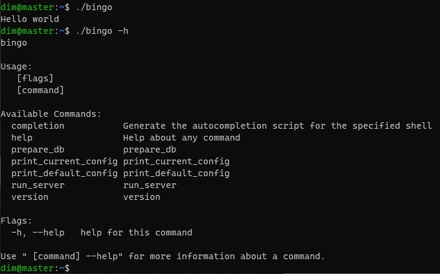

# Yandex-devops
Итоговый проект тренировок yandex-devops

Ссылка на мой стенд: https://bingo.myddns.me/

## ТЗ кратко
Дан бинарный исполняемый файл. Необходимо развернуть отказоустойчивую инсталляцию приложения из имеющегося бинарника до
даты запуска продукта. Планируется стабильная нагрузка в 60 RPS, пиковая в 120 RPS.

Полное ТЗ [тут](https://docs.yandex.ru/docs/view?url=ya-disk-public%3A%2F%2FaZFzSWnWcEBeFUQaZTVH7mko2C8kWAY5drce3M9qlgYGtAG6xLa0qQ37gSVWb4T4q%2FJ6bpmRyOJonT3VoXnDag%3D%3D&name=%D0%98%D1%82%D0%BE%D0%B3%D0%BE%D0%B2%D1%8B%D0%B9%20%D0%BF%D1%80%D0%BE%D0%B5%D0%BA%D1%82.docx&nosw=1)

# Локальное исследование черного ящика


#### Первый запуск

<center></center>


Разбираемся дальше.

Подсмотрим конифгурацинный файл командой `print_default_config`
и создадим свой конфигурационный файл.

А путь к нему и путь к файлу логов укажет утилита strace:

`strace ./bingo run_server`

Создадим необходимые файлы с нужными правами.

Также мы видим ручку prepare_db, она здесь не просто так.

Установим и запустим БД, подробная настройка БД будет описана далее.
Заполняем командой `./bingo prepare_bd`

После чего запустим:
`./bingo run_server`

#### Наконец сервер работает и мы получаем первый код

<center></center>

Посмотрим с помощью netstat порт сервера, через curl отправляем запрос или постучимся в браузере и получаем второй код.

<center></center>


### Выбор стека технологий

С базой данных все понятно из исследования bingo. А на чем строить отказоустоичивость и балансировку нагрузки надо решать. Я развернул проект в Yandex Cloud.
В качестве ОС выбрал Ubuntu 20.04.
А ноды и сервер балансировки решил развернуть на nginx.

Итого - 3 машины
- _Балансер_ - Intel Ice Lake, 2 vCPU, 1Гб RAM
- _Нода 1_ - Intel Ice Lake, 2 vCPU, 2Гб RAM
- _Нода 2_ - Intel Ice Lake, 2 vCPU, 1Гб RAM

# Архитектура проекта

<center></center>
<p>

# Ускоряем старт (Патчим бинарь)

При запуске, bingo отправляет запрос по ip адресу 8.8.8.8.
Найдем эту функцию, ей оказалась net_http___Client__do, она вызывается 2 раза,
поэтому в данном случае можно запатчить.

<center></center>

Сделаем так, чтобы функция net_http___Client__do выполняла только одну инструкцию, для этого начале этой функции
поставим инструкцию ret по адресу 0x6EE760.

<center></center>

Остальной код, подсвеченный в IDA красным светом, "повис в воздухе", потому что не используется.

Функция net_http___Client__do входит в состав пакета pkg.go.dev/net/http, поэтому данный патч **не применим** в проектах, где активно используются фукнции пакета, патч может нарушить работоспособность программы. 

Пробуем запустить, приложение сразу стартует, и мы получаем третий код.

<center></center>


# Настройка базы данных
Действия выполняются на ноде 1.

<details>
  <summary>Установка и запуск</summary>

  ```bash
  wget --quiet -O - https://www.postgresql.org/media/keys/ACCC4CF8.asc | sudo apt-key add -
  echo "deb http://apt.postgresql.org/pub/repos/apt/ $(lsb_release -cs)-pgdg main" | sudo tee /etc/apt/sources.list.d/postgresql-pgdg.list &gt; /dev/null
  sudo apt-get update
  sudo apt-get install postgresql-14 postgresql-contrib
  sudo systemctl start postgresql
  ```
</details>
<p>
<details>
  <summary>Установка пароля пользователю postgres</summary>

  ```bash
  sudo -u postgres psql
  ALTER USER postgres WITH PASSWORD 'postgres';
  ```
</details>
<p>

- В файле postgesql.conf изменим параметр:
`listen_addresses = '192.168.10.4'`

- В файл pg_hba.conf в раздел  `# IPv4 local connections:` добавим строку
  
`host    all             all             192.168.10.0/24         trust`

Для первого этапа всё, но...

При тестировании на веб-сервисе после настройки отказоустойчивости будет видно, что не проходят тесты, связанные с запросами к БД. Забегая вперед, решим эту проблему.

Например, запрос `SELECT sessions.id, sessions.start_time, customers.id, customers.name, customers.surname, customers.birthday, customers.email, movies.id, movies.name, movies.year, movies.duration FROM sessions INNER JOIN customers ON sessions.customer_id = customers.id INNER JOIN movies ON sessions.movie_id = movies.id ORDER BY movies.year DESC, movies.name ASC, customers.id, sessions.id DESC LIMIT 100000` приводит к ошибке:

```
2023-11-26 09:41:58.062 UTC [73806] FATAL:  terminating connection due to administrator command
2023-11-26 09:41:58.571 UTC [5878] LOG:  background worker "parallel worker" (PID 73806) exited with exit code 1
2023-11-26 09:41:58.571 UTC [5878] LOG:  background worker "parallel worker" (PID 73805) exited with exit code 1
2023-11-26 09:41:58.583 UTC [73785] postgres@postgres LOG:  could not send data to client: Broken pipe
2023-11-26 09:41:58.583 UTC [73785] postgres@postgres FATAL:  connection to client lost
```

Для быстрого доступа к данным я создал индексы
```bash
postgres=# postgres=# SELECT * FROM pg_indexes WHERE tablename not like 'pg%';
 schemaname |     tablename     |       indexname        | tablespace |                                                 indexdef
------------+-------------------+------------------------+------------+----------------------------------------------------------------------------------------------------------
 public     | schema_migrations | schema_migrations_pkey |            | CREATE UNIQUE INDEX schema_migrations_pkey ON public.schema_migrations USING btree (version)
 public     | sessions          | my_index               |            | CREATE INDEX my_index ON public.sessions USING btree (id)
 public     | sessions          | my_index_big_sessions  |            | CREATE INDEX my_index_big_sessions ON public.sessions USING btree (id, start_time)
 public     | customers         | my_index_big_customers |            | CREATE INDEX my_index_big_customers ON public.customers USING btree (id, name, surname, birthday, email)
 public     | movies            | my_index_big_movies    |            | CREATE INDEX my_index_big_movies ON public.movies USING btree (id, name, year, duration)
(5 rows)
```

# Настройка балансера

Выбрана версия nginx - 1.25.3. (Забегая вперед отметим, что эта версия поддерживает HTTP3)

<details>
  <summary>Установка nginx</summary>

  ```bash
sudo apt install curl gnupg2 ca-certificates lsb-release ubuntu-keyring
curl https://nginx.org/keys/nginx_signing.key | gpg --dearmor \
    | sudo tee /usr/share/keyrings/nginx-archive-keyring.gpg >/dev/null
gpg --dry-run --quiet --no-keyring --import --import-options import-show /usr/share/keyrings/nginx-archive-keyring.gpg
echo "deb [signed-by=/usr/share/keyrings/nginx-archive-keyring.gpg] \
http://nginx.org/packages/mainline/ubuntu `lsb_release -cs` nginx" \
    | sudo tee /etc/apt/sources.list.d/nginx.list
echo -e "Package: *\nPin: origin nginx.org\nPin: release o=nginx\nPin-Priority: 900\n" \
    | sudo tee /etc/apt/preferences.d/99nginx
sudo apt update
sudo apt install nginx
```
</details>
<p>


На первом этапе были выполнены следующие действия:
- Создание раздела upstream, который распределяет трафик
между двумя нодами. Добавлены условия, что в случае ошибок, необходимо не отправлять запросы на вышедший из строя сервер.
- Настройка кэширования (proxy_cache) для /long_dummy
- Бесплатное получение домена 3-го уровня на сервисе https://www.noip.com/
- Конфигурирование обработки запросов на портах 80 и 443 с поддержка протокола https на самоподписанном сертификате

Далее приведена финальная версия конфигурационного файла nginx с выполнением пунктов из ТЗ со звездочкой. 

<details>
  <summary>Итоговая версия /etc/nginx/conf.d/default.conf</summary>

  ```
upstream backend {
      server 192.168.10.4:80;
      server 192.168.10.18:80;
}

proxy_cache_path /var/cache/nginx keys_zone=cache_zone:1m;

server {
    listen 80;
    listen [::]:80;
    server_name bingo.myddns.me;

    location /long_dummy {
       proxy_cache cache_zone;
       proxy_cache_valid 1m;
       proxy_pass http://backend;
    }

    location / {
       proxy_pass http://backend;
       proxy_next_upstream error timeout invalid_header http_500 http_502 http_503 http_504 non_idempotent;
       proxy_intercept_errors on;
       proxy_http_version 1.1;
       proxy_set_header Upgrade $http_upgrade;
       proxy_set_header Connection "upgrade";
      }
}

log_format quic '$remote_addr - $remote_user [$time_local] '
                '"$request" $status $body_bytes_sent '
                '"$http_referer" "$http_user_agent" "$http3"';

access_log logs/access.log quic;

server {
    listen 443 quic reuseport; # QUIC
    listen 443 ssl http2;      # TCP
    server_name bingo.myddns.me;
    add_header Alt-Svc 'h3=":443"; ma=3600';
    ssl_early_data on;
    ssl_certificate /etc/letsencrypt/live/bingo.myddns.me/fullchain.pem; # managed by Certbot
    ssl_certificate_key /etc/letsencrypt/live/bingo.myddns.me/privkey.pem; # managed by Certbot
    ssl_protocols TLSv1 TLSv1.1 TLSv1.2 TLSv1.3;

    location /long_dummy {
       proxy_cache cache_zone;
       proxy_cache_valid 1m;
       proxy_pass http://backend;
    }

    location / {
       add_header Alt-Svc 'h3=":$server_port"; ma=86400';
       add_header X-protocol $server_protocol always;
       proxy_pass http://backend;
       proxy_http_version 1.1;
       proxy_next_upstream error timeout invalid_header http_500 http_502 http_503 http_504 non_idempotent;
       proxy_intercept_errors on;
       proxy_set_header Upgrade $http_upgrade;
       proxy_set_header Connection "upgrade";
      }
}

server {
    listen 8080;
    # Optionally: allow access only from localhost
    # listen 127.0.0.1:8080;

    server_name bingo.myddns.me;

    location /status {
        stub_status;
    }
}
```
</details>
<p>


# Настройка обеих нод, действия на нодах дублируются

Редактирование конфига /opt/bingo/config.yaml
```
student_email: my-email@email.ru
postgres_cluster:
  hosts:
  - address: 192.168.10.4  # Адрес ноды 1
    port: 5432
  user: postgres
  password: postgres
  db_name: postgres
  ssl_mode: disable
  use_closest_node: false
```

### Запуск bingo как службы (потому что иногда падает)

Создаем файл /etc/systemd/system/bingo.service

```
[Unit]
Description=bingo
After=multi-user.target

[Service]
Type=simple
User=dim
Restart=always
RestartSec=5
WorkingDirectory=/home/dim
ExecStart=/home/dim/bingo run_server

[Install]
WantedBy=multi-user.target
```

Запуск:

```bash
sudo systemctl daemon-reload
sudo systemctl enable bingo
sudo systemctl start bingo
```

### Прикручиваем bingo к nginx
Возьмем версию nginx, которая устанавливается по умолчанию - 1.18.0, 
в локальной сети нам не обязателен HTTP3,
общение происходит по HTTP, а доступ наружу закрыт.

```sudo apt install nginx```

Редактируем файл
`/etc/nginx/sites-available/default`
```
server {
    listen 192.168.10.4:80;
    server_name bingo.myddns.me;
    location / {
        proxy_pass  http://127.0.0.1:7939;
    }
    allow 192.168.10.0/24;
    deny all;
}
```

Перезагружаем nginx:

```sudo systemctl restart nginx```

### Создаем на нодах healhchecker (потому что иногда bingo болеет)

Действия выполняются на обеих нодах.
```
#!/bin/bash

while true; do
    response=$(curl -s http://192.168.10.{X}:80)
    if [[ "$response" == "I feel bad."* ]]; then
        echo "Service feels bad. Restarting..."
        systemctl restart bingo
    fi
    sleep 20
done
```

И сделаем его службой linux, аналогично пункту выше.

Используем файл `/etc/systemd/system/checker.service`

```
[Unit]
Description=healthchecker
After=multi-user.target

[Service]
Type=simple
User=dim
Restart=always
RestartSec=5
WorkingDirectory=/home/dim
ExecStart=/bin/bash checker.sh

[Install]
WantedBy=multi-user.target
```

Запуск:

```bash
sudo systemctl daemon-reload
sudo systemctl enable checker.service
sudo systemctl start checker.service
```

# HTTP3

В конфигурационный файл nginx 1.25.3 были добавлены директивы:
```
listen 443 quic reuseport; # QUIC
add_header Alt-Svc 'h3=":443"; ma=3600';
```

Также был заменен сертификат с самоподписанного на сертификат, выпущенный при помощи сервиса Let's Encrypt. Без этого некоторые клиентские сервисы отказываются переходить на протокол HTTP3, например Google. Также, через некоторые виды туннелирования может не произойти переход на HTTP3.

Следуя [инструкции](https://certbot.eff.org/instructions?ws=nginx&os=ubuntufocal), сертификат был установлен. Сервис по выпуску сертификата самостоятельно дополнил в конфигурационный файл редирект с 80 на 443 порт. По ТЗ такого быть не должно, поэтому редирект был отключен.

Демонстрация HTTP3:

<center></center>


# Сбор метрик (Exporter + Prometeus + Grafana)

По настройке экспорта и отображения метрик я следовал [инструкции](https://antonputra.com/monitoring/monitor-nginx-with-prometheus/).

Отличался только пункт с установкой Grafana, так как заблокированы IP адреса некоторых стран. Все отличие заключается в установке графаны через TOR.

```bash
sudo apt install tor
sudo su root
. torsocks on
wget -q -O - https://packages.grafana.com/gpg.key | apt-key add -
echo "deb https://packages.grafana.com/oss/deb stable main" | tee -a /etc/apt/sources.list.d/grafana.list
apt update
apt -y install grafana
systemctl enable grafana-server
systemctl start grafana-server
. torsocks off
```
Под конец процесса torsocks может выдавать ошибки и Grafana не доустановится.
Чтобы доустановить, нужно выполнить команду `sudo apt -y install grafana` без torsocks.


<details>
  <summary>Dashboards с метриками</summary>
  
  <center></center>
  <p>
  <center></center>

</details>

<p>

# Security

Ну и несколько моментов для обеспечения информационной безопасности.

- на ноде 1 оставляем открытым для всеобщей сети порт 22, для локальной - 80, 5432;
- на ноде 2 оставляем открытым для всеобщей сети порт 22, для локальной - 80;
- на балансере оставляем порты 22, 80, 443, 3000;
- для подключения по ssh используем ключи.

Порты закроем с помощью ufw

### Балансер

```bash
dim@balancer:~$ sudo ufw status verbose
Status: active
Logging: on (low)
Default: deny (incoming), allow (outgoing), disabled (routed)
New profiles: skip

To                         Action      From
--                         ------      ----
22                         ALLOW IN    Anywhere
80/tcp                     ALLOW IN    Anywhere
443/tcp                    ALLOW IN    Anywhere
3000/tcp                   ALLOW IN    Anywhere
443/udp                    ALLOW IN    Anywhere
22 (v6)                    ALLOW IN    Anywhere (v6)
80/tcp (v6)                ALLOW IN    Anywhere (v6)
443/tcp (v6)               ALLOW IN    Anywhere (v6)
3000/tcp (v6)              ALLOW IN    Anywhere (v6)
443/udp (v6)               ALLOW IN    Anywhere (v6)
```

### Нода 1

```bash
dim@master:~$ sudo ufw status verbose
Status: active
Logging: on (low)
Default: deny (incoming), allow (outgoing), deny (routed)
New profiles: skip

To                         Action      From
--                         ------      ----
22/tcp                     ALLOW IN    Anywhere
80                         ALLOW IN    192.168.10.0/24
5432                       ALLOW IN    192.168.10.0/24
22/tcp (v6)                ALLOW IN    Anywhere (v6)
```

### Нода 2

```bash
dim@slave:~$ sudo ufw status verbose
Status: active
Logging: on (low)
Default: deny (incoming), allow (outgoing), disabled (routed)
New profiles: skip

To                         Action      From
--                         ------      ----
22/tcp                     ALLOW IN    Anywhere
80                         ALLOW IN    192.168.10.0/24
22/tcp (v6)                ALLOW IN    Anywhere (v6)
```

# Итог

Задание выполнено, приобретен новый опыт и знания, а также получен дофамин от такого количества зеленых плюсиков и от задания в целом))

<details>
  <summary>Скриншот тестирующего сервиса</summary>

  <center></center>

</details>


